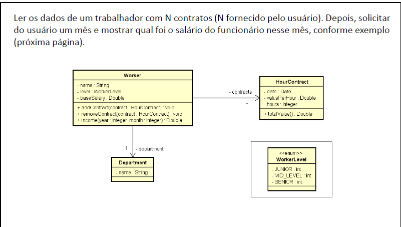
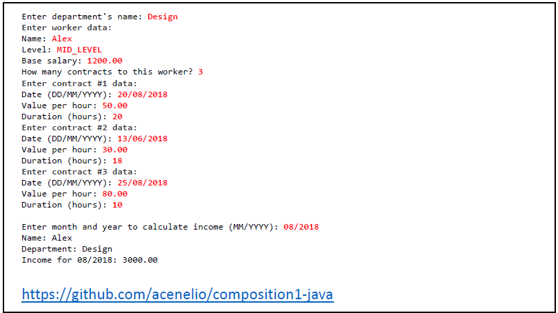

# Seção 12: Enumerações e Composições - Exercício 01

## Complemento do exercício

Crie a classe dependencies, que registrará os dependentes desse funcionário. Um funcionário pode ter mais de um dependente.
No dependente deve ter o nome, sexo, tipo e data de nascimento.
O sexo deve ser um enum com as opções M e F. O tipo também deve ser um enum com as opções CONJUNGE e DESCENDENTE.

Adicione ao programa a pergunta quantos dependentes o funcionário tem e digite conforme a tabela abaixo.
Então, embaixo do income, deve mostrar quantas filhas o funcionário têm e quantos anos ela tem

| name           | genre | type        | birthDate  |
| -------------- | ----- | ----------- | ---------- |
| Simone Luisa   | F     | CONJUNGE    | 01/08/1988 |
| Estefani Luisa | F     | DESCENDENTE | 09/05/2015 |
| Marcelo Motta  | M     | DESCENDENTE | 22/07/2018 |