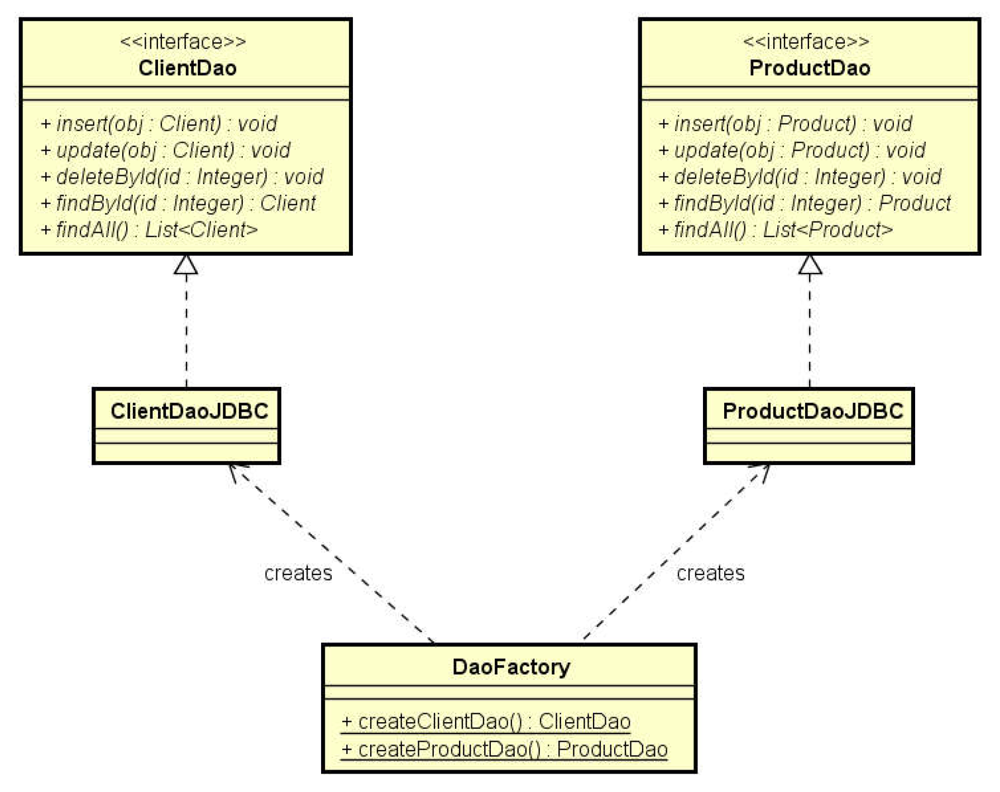

# Seção 21: Padrão de projeto DAO

## Resumo
- Para cada entidade, haverá um objeto responsável por fazer acesso a dados relacionado a esta
entidade. Por exemplo:
  - Cliente: ClienteDao
  - Produto: ProdutoDao
  - Pedido: PedidoDao
- Cada DAO será definido por uma interface.
- A injeção de dependência pode ser feita por meio do padrão de projeto Factory

## Referências
- https://www.devmedia.com.br/dao-pattern-persistencia-de-dados-utilizando-o-padrao-dao/30999
- https://www.oracle.com/technetwork/java/dataaccessobject-138824.html